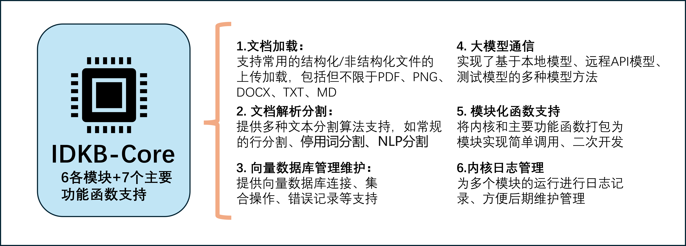
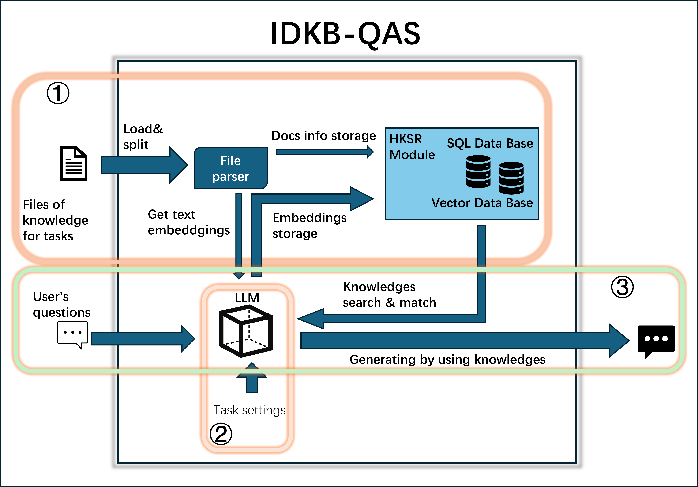
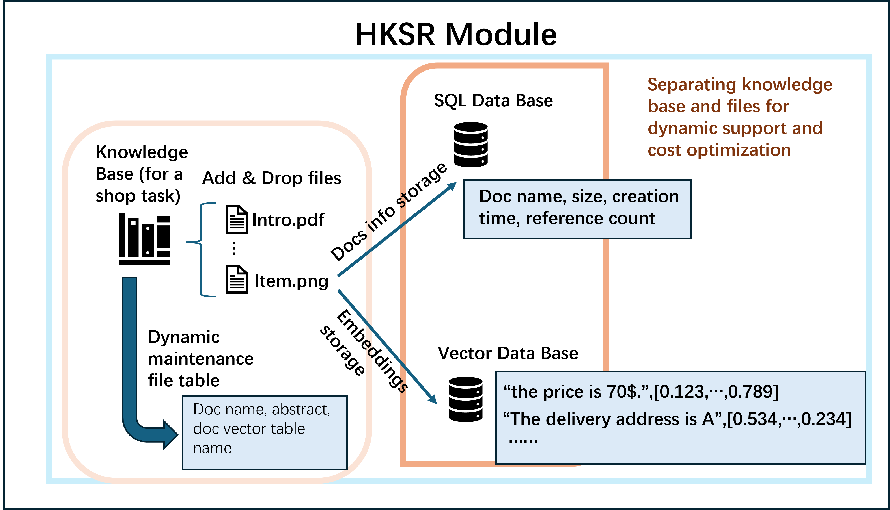
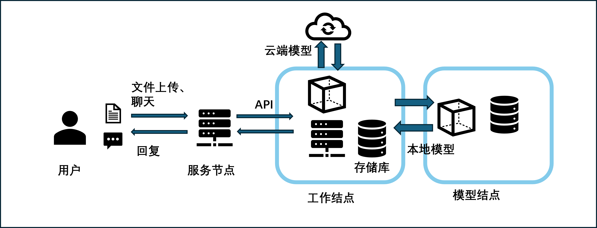
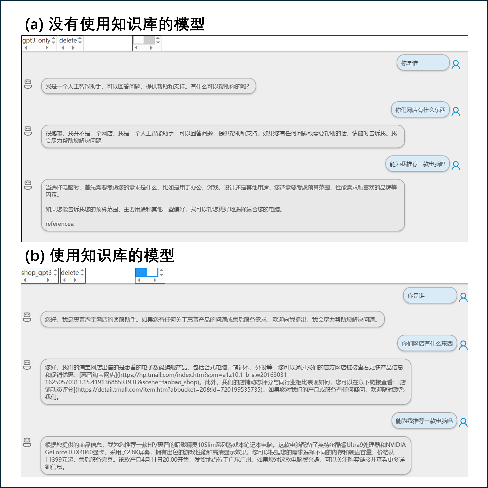

# IDKB-QAS：Independent Dynamic Knowledge-Based Retrieval Augmented Question-Answering Systems

>[demo online](https://idkb.aidroid.top/idkb/)

>[view our blog for implement details](https://blog.aidroid.top/ai/nlp/projects/idkb)


> The development of machine customer service technology can provide society with professional customer service and help the development of enterprises. Although the language model continues to evolve and the model's text comprehension and generation capabilities have improved substantially, there is still a lack of expertise in multi-vertical domain tasks, and existing RAG techniques require fine-tuned training for the task resulting in the inability to use an external knowledge base for multiple tasks. We propose a retrieval-enhanced question-and-answer system (IDKB-QAS) with an independent dynamic knowledge base, which introduces an independent external knowledge base to realize dynamic knowledge base extension, eliminates the fine-tuning training of the knowledge base to satisfy multitasking requirements, and improves the accuracy of knowledge retrieval by improving the knowledge retrieval method. Meanwhile, we design a hierarchical knowledge storage retrieval module, HKSR, which reduces the storage and computation costs of the system's knowledge base and realizes an efficient management model for multi-user and multi-tasking. The performance in multi-vertical domain tasks has been significantly improved, realizing the ability to provide intelligent customer service under multi-tasks with complex knowledge requirements.


## 项目框架

### IDKB-Core
> The IDKB module includes communication, operation management and maintenance of multiple databases and language models, as well as analysis and processing of system input files and texts. Therefore, it is necessary to first analyze and implement the core functions of the module and package it into a kernel module package with the main function Development support. The main functions of the IDKB-Core kernel module are shown in Figure 1, including six parts: document loading, document parsing and segmentation, vector database management and maintenance, large model communication, modular function direct calling support, and kernel log management.


### IDKB
>The overall architecture and workflow of the IDKB question and answer system. The system mainly encapsulates the main functions and provides interfaces based on the kernel. The file analyzer synchronizes the information and content blocks of uploaded files to the SQL database and vector database respectively. In addition to providing us with text generation, the language model also provides support for vector representation of text

### HKSR
> Most of the current knowledge bases of RAG projects do not implement multi-user support or the files of the knowledge base are fixed in the knowledge base. These methods cannot be used in multi-user scenarios with limited resources. In order to solve the user and resource limitation issues of RAG, we designed the HKSR storage module (shown in Figure 4) to implement multi-user dynamic update support for the knowledge base and give full play to the language model generation capabilities. Specifically, to realize the dynamic update of knowledge base files, we constructed the file database object File, the knowledge base database object KnowledgeBase and the conversation database object ChatModel respectively. The files and knowledge base objects correspond to the files and knowledge base objects of the vector database in the kernel. These two objects must ensure the consistency of operations and prevent data inconsistencies. At the same time, it is necessary to design a synchronization method for the two database objects. In this project, we encapsulate the operations of vector objects into structured database object operations to ensure the consistency of database operations, exception handling, and response.

## 环境要求

>The actual working mode of the IDKB-QAS system. The service node provides front-end business services, and the model node deploys a local language model. The system is mainly deployed on the working node, communicates with the model node and the cloud, and provides database and API support for the server node. The entire system provides a total of 25 APIs to ensure the stable operation of the system


### servernode
```
django==4.0
mysql
```
### workernode
```
django==4.0
mlivus
mysql
docker
```

### modelnode
```
flask
chatglm3-6b
```


## 项目部署

## 对比




# icense
This project is licensed under the license found in the LICENSE file in the root directory of this source tree. 


# Reference
If you find our work is useful in your research, please cite the following paper:
```shell
@article{IDKB-QAS,
  title   = {IDKB-QAS：Independent Dynamic Knowledge-Based Retrieval Augmented Question-Answering Systems},
  author  = {Yang Wang},
  eprint={},
  archivePrefix={arXiv},
  primaryClass={},
  year={2024}
}
```