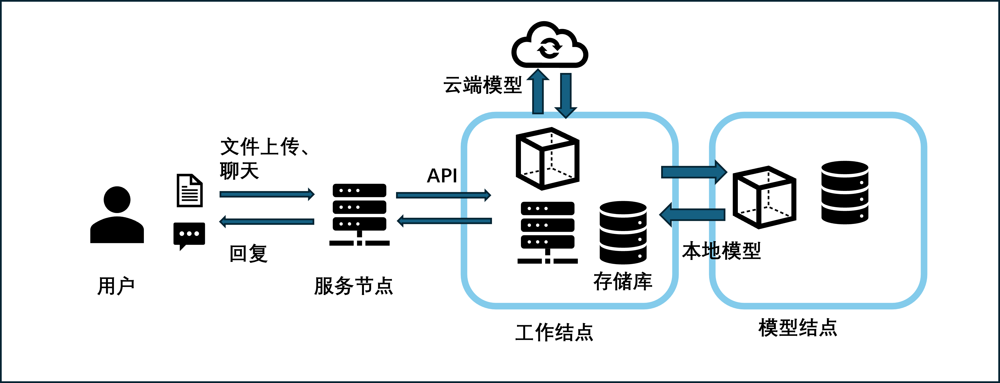

# IDKB-QAS：Independent Dynamic Knowledge-Based Retrieval Augmented Question-Answering Systems

>[项目地址](https://idkb.aidroid.top/idkb/)


> 机器客服技术的发展能够为社会提供专业的客户服务、助力企业发展。虽然语言模型不断发展，模型的文本理解和生成能力大幅度提高，但在多垂直领域任务中仍然存在专业知识不足的问题，现有的RAG技术需要对任务进行微调训练导致无法对多任务使用外部知识库。我们提出了独立动态知识库的检索增强问答系统(IDKB-QAS)，引入独立的外部知识库实现动态知识库扩展，取消对知识库的微调训练来满足多任务需求，通过改进知识检索方法来提高知识检索的准确度。同时我们设计一种层次化知识存储检索模块HKSR，减少了系统知识库的存储成本和计算成本，并实现了多用户多任务的高效管理模式。在多垂直领域任务中的表现有了明显提升，实现了能够在复杂知识要求的多任务下提供智能化的客服服务。


## 项目框架

### IDKB-Core
> IDKB模块包括了对多个数据库、语言模型的通信、操作管理维护，以及对系统输入文件和文本的分析处理，因此需要先对模块的核心功能分析实现，打包成一个内核模块包为主要功能的开发提供支持。IDKB-Core内核模块的主要功能如图1所示，包括文档加载、文档解析分割、向量数据库管理维护、大模型通信、模块化函数直接调用支持以及内核日志管理这6个部分。


### IDKB
>IDKB问答系统的整体架构和工作流程，系统主要是在内核基础上将主要的功能封装，提供接口。其中文件分析器是对上传文件的信息和内容块分别同步到SQL数据库和向量数据库中。语言模型为我们提供文本的生成之外，还提供文本的向量表示支持

### HKSR
> 当前大部分的RAG项目的知识库没有实现多用户支持或知识库的文件是固定在知识库中的，这些方法没有办法在资源有限的多用户场景中使用。为了解决RAG的用户和资源限制问题，我们设计了HKSR存储模块（如图4所示），实现知识库的多用户动态更新支持，充分发挥语言模型的生成能力。具体的，要实现知识库文件的动态更新，我们分别构建了文件数据库对象File、知识库数据库对象KnowledgeBase和对话的数据库对象ChatModel。其中文件和知识库的对象对应着内核中向量数据库的文件和知识库对象，这两个对象要保证操作的一致性，防止出现数据不一致的问题，同时需要设计两种数据库对象的同步方法，在本项目中，我们将向量对象的操作封装到结构化数据库对象操作内，保证数据库的操作、异常处理、响应的一致性。

## 环境要求

>IDKB-QAS系统的实际工作模式。服务节点提供前端业务服务，模型结点部署本地的语言模型，其中系统主要部署在工作结点，与模型结点和云端通信，为服务器结点提供数据库和API支持。整个系统总共提供了25个API，为系统的稳定运行提供保障 


### servernode
```
django==4.0
mysql
```
### workernode
```
django==4.0
mlivus
mysql
docker
```

### modelnode
```
flask
chatglm3-6b
```


## 项目部署

## 对比

